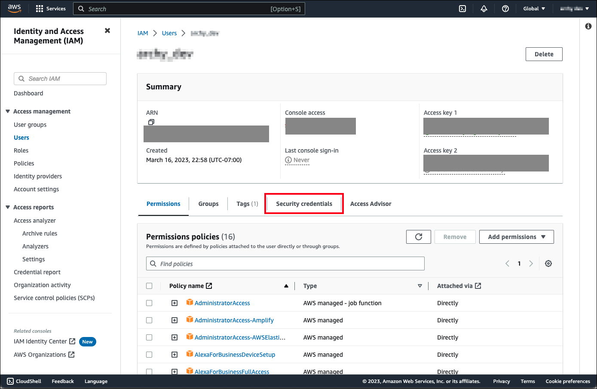
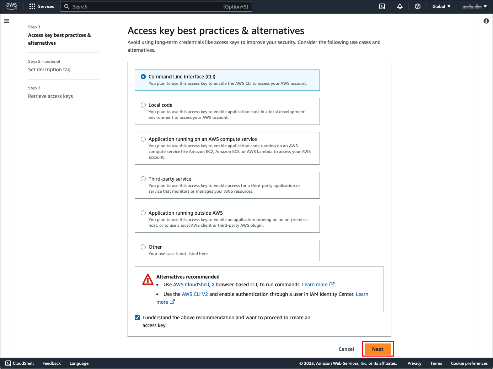
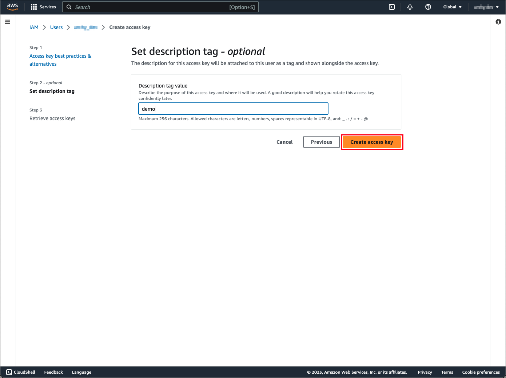

# Adobe Photoshop API SDK Beta

## Set up Photoshop API automation project by running one command

This SDK helps you to set up a new project and installs [Adobe Photoshop API Library](https://github.com/adobe/aio-lib-photoshop-api) that enables the wide range of image editing features that span Photoshop, Lightroom, and Sensei services by running one command.

If you already have a project or service that needs Adobe Photoshop API Library, go to [Adobe Photoshop API Library](https://github.com/adobe/aio-lib-photoshop-api).

### Quick Start

```
npx create-adobe-photoshop-api-sdk my-project
cd my-project
```
Running these commands will create a directory called my-project inside the current folder. Inside that directory, it will generate the initial project structure and install the dependencies:
```
my-project
├── README.md
├── node_modules
├── package.json
├── .gitignore
├── config (your credential information goes here)
│   ├── adobe-template.js
│   ├── aws-template.js
│   └── config.js
└── src
    ├── sample
    │   ├── batch_script (This directory contains Photoshop API sample scripts for batch jobs)
    │   └── psapi (This directory contains Photoshop API sample scripts for a single job)
    └── testfiles (This directory contains test files that are used in sample scripts)
```
### Set your configuration
You need to configure your Photoshop API credentials

1. Open `config/adobe-template.js` and save as `config/adobe.js`.
1. Fill in the information in `config/adobe.js`. Everything you need to fill out can be found in your [console](https://developer.adobe.com/console/projects). If you have not created your credential yet, go to [Getting started with Photoshop API](https://developer-stage.adobe.com/photoshop/photoshop-api-docs/getting-started/#get-access).

   ```
   // Adobe Photoshop API Configuration
   // https://developer.adobe.com/console/projects -> project -> OAuth Server-to-Server

   const adobeConfig = {
      clientId: "",
      clientSecret: "",
      orgId: ""
   };
   ```
   

### Run the very first Photoshop 'Hello World' API using this SDK

```
node src/sample/psapi/00_helloWorld.js
```

You will see API response that says, `Welcome to the Photoshop API!`
## Input/Output Storage Options

We support external services such as AWS S3, Azure, Dropbox, Google Drive.  The below is how you can set up the external storage using AWS S3.

### Access to AWS
   1. If you don't already have an AWS account you can create one [here](https://docs.aws.amazon.com/rekognition/latest/dg/setting-up.html).
   1. Once your account is created create an S3 bucket by going [here](https://s3.console.aws.amazon.com/s3/buckets).
   1. Click on “Create bucket” and name your bucket. 

#### Create AWS access key

1. If you do not have an AWS access key already you will need to create one by going to [AWS IAM console](https://us-east-1.console.aws.amazon.com/iamv2/home?region=us-west-2#/users).
1. Click on your user name. 
1. Click on "Security credentials" 
1. Scroll down the page and click on "Create access key" 
1. Select "Command Line Interface" and click "Next"  
1. Enter a name for your access key and click on “Create access key”  
1. Copy and paste the “Secret access key” and store it in a safe place. You will need it in the next step.
  _We recommend downloading the .csv file and storing it in a safe location as the Secret will not be accessible after you leave the screen_ 

#### Set up AWS CLI

 1. Install [AWS CLI](https://docs.aws.amazon.com/cli/latest/userguide/getting-started-install.html) 
 1. Configure AWS CLI by running the following command in your terminal `aws configure`
 1. If you already have an aws profile you would need to run `aws configure [--profile profile-name]`  
 1. You will need to enter the following information
 1. Add your AWS access key 
 1. AWS Secret access key 
 1. Default region (choose a region closest to you for faster processing) 
 1. Default output format: NONE
 1. Test AWS CLI: Run the following command `aws s3 ls` to verify everything is configured correctly. The command should return a list of your available buckets. 


```
// AWS Configuration
// https://aws.amazon.com/console/
const awsConfig = {
  region: "", // us-east-1
  bucketName: "" // aws s3 bucket name
}
```

## Run Sample Script

### Run a sample script (src/sample/psapi/...)

1. Run a sample script to remove background of the image

```
node src/sample/psapi/01_createCutout.js
```

2. Find your output file in your S3 storage, output directory (ex: s3://<awsConfig.bucketName>/output/...)

### Run a sample scrip for a batch job (src/sample/batch_script/...)

1. Store multiple JPEG files in your S3 storage (ex: s3://<awsConfig.bucketName>/input/...) or modify input/output directories in the sample script.
```
// -------------------------------------------------
// Enter your parameters
// -------------------------------------------------
const inputDir = 'input/' //your input directory in S3 bucket (ex: s3://<awsConfig.bucketName>/input)
const outputDir = 'output' //your output directory in S3 bucket (ex: s3://<awsConfig.bucketName>/input/output)

const listObjectsInputRequest = { //URI Request Parameters
  // Add more request as you like.  see https://docs.aws.amazon.com/AmazonS3/latest/API/API_ListObjectsV2.html for more details
  Bucket: awsConfig.bucketName, //Bucket name to list.
  Prefix: inputDir, // Keys that begin with the indicated prefix.
  MaxKeys: 5 // Sets the maximum number of keys returned in the response. By default the action returns up to 1,000 key names.
};
// -------------------------------------------------
```
2. Run a sample script to remove background of the multiple images

```
node src/sample/batch_job/01_createCutout_batch.js
```

3. Find your output files in your S3 storage, output directory (ex: s3://<awsConfig.bucketName>/input/output/...)

- You can also use AWS CLI to sync files from your S3 storage into your local machine (ex: `aws s3 sync s3://<awsConfig.bucketName>/input/output/ /Users/<username>/Desktop/output/`)

## Links

- [Getting started with Photoshop API](https://developer-stage.adobe.com/photoshop/photoshop-api-docs/getting-started/#get-access)
- [Photoshop API documentation](https://developer.adobe.com/photoshop/photoshop-api-docs/api/)
- [Demo](https://developer.adobe.com/photoshop/api/demo/)
- [Curl command examples](https://developer.adobe.com/photoshop/photoshop-api-docs/code-sample/)
- [Supported Features](https://developer.adobe.com/photoshop/photoshop-api-docs/features/)
- [Submit a ticket for support or feedback](https://psd-services.zendesk.com/hc/en-us/requests/new)
